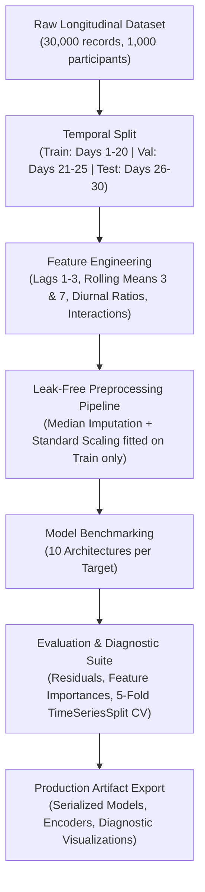

# Nicotine Craving and Anxiety Dynamics: Time-Series Forecasting

A production-grade machine learning and deep learning pipeline for forecasting longitudinal nicotine craving and anxiety dynamics across a 30-day smoking cessation monitoring window.

---

## Executive Summary

Cigarette smoking and nicotine pouch withdrawal are characterized by non-linear behavioral and physiological fluctuations. Relapse risk is strongly driven by acute spikes in nicotine craving and compounding anxiety. Understanding and accurately forecasting these temporal trajectories enables timely, proactive behavioral interventions.

This project develops an end-to-end time-series forecasting framework trained on longitudinal data from 1,000 participants monitored continuously over 30 consecutive days (30,000 observational records). The pipeline benchmarks 10 distinct modeling approaches—spanning regularized linear baselines, ensemble tree methods, gradient boosting architectures (XGBoost, LightGBM), and deep sequential recurrent networks (LSTM)—to predict two key target metrics:

1. **Overall Craving Score**: Cumulative daily psychological and somatic urge intensity.
2. **Daily Anxiety Score**: Aggregate daily subjective and physiological anxiety manifestation.

---

## Repository Structure

```
Smoking-Addiction/
├── .gitignore
├── README.md
├── requirements.txt
├── Dataset/
│   └── Nicotine_Craving_Anxiety_Dynamics_30Days.csv
└── Model/
    ├── time_series_forecasting.ipynb
    └── artifacts/
        ├── anxiety_lightgbm.txt
        ├── anxiety_lstm.keras
        ├── anxiety_xgboost.json
        ├── correlation_heatmap.png
        ├── craving_elasticnet.pkl
        ├── craving_gradientboosting.pkl
        ├── craving_histgradientboosting.pkl
        ├── craving_lasso.pkl
        ├── craving_lightgbm.txt
        ├── craving_lstm.keras
        ├── craving_randomforest.pkl
        ├── craving_ridge.pkl
        ├── craving_xgboost.json
        ├── experiment_summary.json
        ├── feature_importance_anxiety.csv
        ├── feature_importance_anxiety.png
        ├── feature_importance_craving.csv
        ├── feature_importance_craving.png
        ├── feature_metadata.json
        ├── forecast_visualization.png
        ├── individual_trajectories.png
        ├── lstm_training_history.png
        ├── model_comparison.png
        ├── per_participant_forecast.png
        ├── preprocessor_anxiety.pkl
        ├── preprocessor_craving.pkl
        ├── residual_analysis.png
        ├── results_anxiety.csv
        ├── results_craving.csv
        ├── target_distributions.png
        └── temporal_trends.png
```

---

## Dataset Overview

The dataset contains granular behavioral, physiological, environmental, and self-reported metrics collected across 30 consecutive days for each participant:

- **Total Observations**: 30,000 rows
- **Cohort Size**: 1,000 unique individuals
- **Temporal Horizon**: 30 consecutive daily records per individual
- **Feature Dimensionality**: 35 original attributes categorized into:
  - Temporal indices (`Participant_ID`, `Day`)
  - Target variables (`Overall_Craving_Score`, `Daily_Anxiety_Score`)
  - Diurnal craving measurements (`Morning_Cravings_Score`, `Afternoon_Cravings_Score`, `Evening_Cravings_Score`, `Craving_Intensity_Peak`, `Craving_Duration_Minutes`)
  - Diurnal anxiety indicators (`Morning_Anxiety_Score`, `Evening_Anxiety_Score`)
  - Physiological markers (`Restlessness_Score`, `Irritability_Score`, `Sleep_Quality_Score`, `Heart_Rate_BPM`)
  - Lifestyle and consumption variables (`Caffeine_Intake_mg`, `Time_Since_Last_Pouch_Minutes`, `Pouches_Per_Day_Reported`)
  - Environmental stressors (`Major_Stress_Event_Today`, `Perceived_Stress_Score`)

---

## Methodology and Pipeline Architecture

The pipeline enforces strict leak-free temporal modeling practices across all stages:



### 1. Temporal Validation Split
To strictly avoid lookahead bias and data leakage, data splitting is executed chronologically across all participants:
- **Training Set**: Days 1 through 20 (66.7% of timeline)
- **Validation Set**: Days 21 through 25 (16.7% of timeline)
- **Holdout Test Set**: Days 26 through 30 (16.7% of timeline)

### 2. Feature Engineering
A total of 49 modeling features are derived per participant without cross-participant leakage:
- **Lag Features**: Autoregressive target values at periods `t-1`, `t-2`, and `t-3`.
- **Rolling Window Statistics**: Moving window averages over 3-day and 7-day retrospective intervals.
- **Diurnal Ratios**: Asymmetry ratios capturing morning-versus-evening shifts (`Craving_Diurnal_Ratio`, `Anxiety_Diurnal_Ratio`).
- **Domain Interaction Terms**: Non-linear interactions combining acute stressors with peak physiological urge intensity (`Stress_x_Craving_Peak`).

### 3. Preprocessing Pipeline
- Numerical features undergo median imputation followed by standard scaling (`StandardScaler`).
- Scalers and transformation parameters are strictly fitted on the training split and applied downstream to validation and test splits.

---

## Benchmark Results

All models were evaluated on the holdout test set (Days 26 to 30) using Mean Absolute Error (MAE), Root Mean Squared Error (RMSE), and the Coefficient of Determination ($R^2$).

### Target: Overall Craving Score

| Model Architecture | Test MAE | Test RMSE | Test $R^2$ |
| :--- | :---: | :---: | :---: |
| **XGBoost** | **0.2350** | **0.3022** | **0.9680** |
| Gradient Boosting | 0.2362 | 0.3036 | 0.9677 |
| HistGradientBoosting | 0.2367 | 0.3043 | 0.9676 |
| LightGBM | 0.2359 | 0.3045 | 0.9675 |
| Random Forest | 0.2379 | 0.3070 | 0.9670 |
| Ridge Regression | 0.2566 | 0.3272 | 0.9625 |
| ElasticNet | 0.2567 | 0.3275 | 0.9624 |
| Lasso Regression | 0.2567 | 0.3281 | 0.9623 |
| LSTM Neural Network | 0.3072 | 0.3910 | 0.9464 |
| Persistence Baseline | 0.7019 | 0.8991 | 0.7167 |

### Target: Daily Anxiety Score

| Model Architecture | Test MAE | Test RMSE | Test $R^2$ |
| :--- | :---: | :---: | :---: |
| **LightGBM** | **0.3315** | **0.4216** | **0.9546** |
| XGBoost | 0.3307 | 0.4218 | 0.9545 |
| Gradient Boosting | 0.3310 | 0.4221 | 0.9545 |
| HistGradientBoosting | 0.3322 | 0.4230 | 0.9543 |
| Ridge Regression | 0.3308 | 0.4257 | 0.9537 |
| ElasticNet | 0.3312 | 0.4259 | 0.9536 |
| Lasso Regression | 0.3325 | 0.4276 | 0.9533 |
| Random Forest | 0.3390 | 0.4309 | 0.9525 |
| LSTM Neural Network | 0.4250 | 0.5384 | 0.9259 |
| Persistence Baseline | 0.8736 | 1.1237 | 0.6773 |

### Cross-Validation Stability
A 5-fold `TimeSeriesSplit` cross-validation was conducted across the temporal axis:
- **Mean Validation RMSE (Craving)**: `0.3117`
- **Standard Deviation**: `0.0053`
The minimal standard deviation validates stability across varying longitudinal horizons without overfitting.

---

## Key Clinical and Behavioral Insights

1. **Diurnal Urge Dominance**:
   - `Evening_Cravings_Score` emerges as the single strongest predictor of overall daily craving intensity, followed by `Afternoon_Cravings_Score`.
   - Behavioral fatigue accumulating toward the end of the day significantly amplifies perceived craving.

2. **Acute Stress Amplification**:
   - The occurrence of an acute stressor (`Major_Stress_Event_Today`) and the interaction term `Stress_x_Craving_Peak` produce substantial non-linear shifts in both craving and anxiety trajectories.

3. **Morning Anxiety as a Leading Indicator**:
   - `Morning_Anxiety_Score` accounts for the largest proportion of feature importance for daily anxiety, indicating that morning symptom severity sets the baseline tone for the entire day.

---

## Setup and Installation

### Prerequisites
- Python 3.10 is required for full compatibility with TensorFlow 2.15.

### 1. Clone the Repository
```bash
git clone https://github.com/YourUsername/Smoking-Addiction.git
cd Smoking-Addiction
```

### 2. Create and Activate a Virtual Environment

#### Windows (PowerShell):
```powershell
py -3.10 -m venv venv
.\venv\Scripts\Activate.ps1
```

#### Windows (Command Prompt):
```cmd
py -3.10 -m venv venv
venv\Scripts\activate.bat
```

#### Linux / macOS:
```bash
python3.10 -m venv venv
source venv/bin/activate
```

### 3. Install Dependencies
```bash
python -m pip install --upgrade pip
pip install -r requirements.txt
```

### 4. Register the Jupyter Kernel
```bash
python -m ipykernel install --user --name smoking-addiction-venv --display-name "Python 3.10 (Smoking Addiction Venv)"
```

---

## Usage

1. Launch your preferred environment (VS Code, JupyterLab, or Jupyter Notebook):
   ```bash
   jupyter lab
   ```
2. Open `Model/time_series_forecasting.ipynb`.
3. In the kernel selection menu (top right), select **Python 3.10 (Smoking Addiction Venv)**.
4. Execute the notebook sequentially to reproduce all feature engineering, model training, cross-validation, and diagnostic visualizations.

All serialized models and figures are automatically saved to `Model/artifacts/`.

---

## Artifact Inventory

| File | Description |
| :--- | :--- |
| `craving_xgboost.json` | Serialized XGBoost model for craving prediction |
| `anxiety_lightgbm.txt` | Serialized LightGBM model for anxiety prediction |
| `craving_lstm.keras` / `anxiety_lstm.keras` | Trained Keras LSTM models with sequential architecture |
| `preprocessor_craving.pkl` | Scikit-learn Pipeline containing imputers and standard scalers |
| `experiment_summary.json` | Comprehensive machine-readable metrics, split thresholds, and CV scores |
| `feature_importance_*.csv` | Ranked feature importance coefficients |
| `*.png` | High-resolution diagnostic charts (residual plots, forecast comparisons, correlations) |

---

## License

This project is licensed under the MIT License - see the LICENSE file for details.
